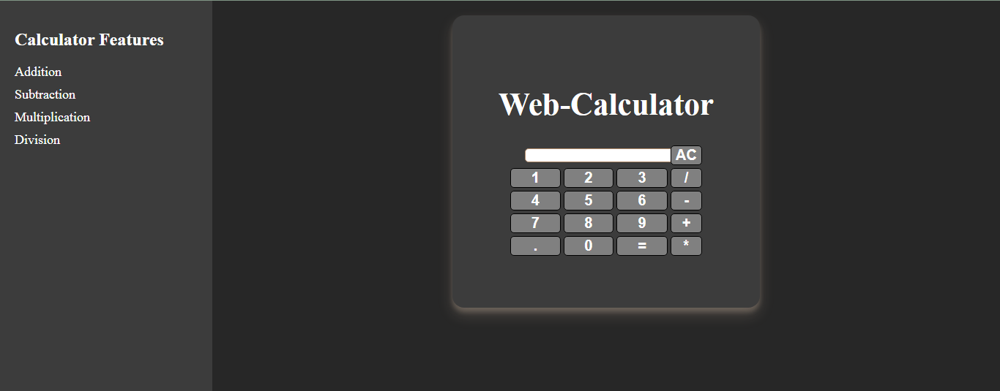

# Web Calculator - HTML, CSS, and JavaScript

Welcome to the Web Calculator project! This simple yet functional calculator is built using HTML, CSS, and JavaScript, and it's a great way to explore the fundamentals of web development.



## Features

- Basic arithmetic operations: addition, subtraction, multiplication, and division.
- Clear button to reset the input and result.
- Responsive design for both desktop and mobile devices.
- Simple and intuitive user interface.

## Getting Started

1. Clone this repository to your local machine using the following command:

   ```bash
   git clone https://github.com/priyanshiChaudhary-58/Task2_WebCalc_aidTech.git
   ```

2. Open the project folder in your code editor.

3. Open `Calculator.html` in your web browser to use the calculator.

## Usage

1. Click on the calculator buttons to input numbers and operations.

2. Click the "=" button to calculate the result.

3. To clear the input and result, click the "AC" button.

## Project Structure

The project structure is as follows:

- `Calculator.html`: The HTML structure of the calculator.
- `Calculator.css`: The CSS file for styling the calculator.
- `Calculator.js`: The JavaScript code for handling user input and performing calculations.

## Customization

Feel free to customize the calculator's appearance and functionality by modifying the CSS and JavaScript files. You can add more features or change the styling to suit your preferences.

## Contributing

Contributions are welcome! If you have any improvements or feature suggestions, please open an issue or submit a pull request.


Happy calculating! 🧮✨
